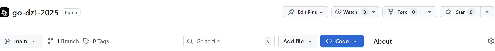
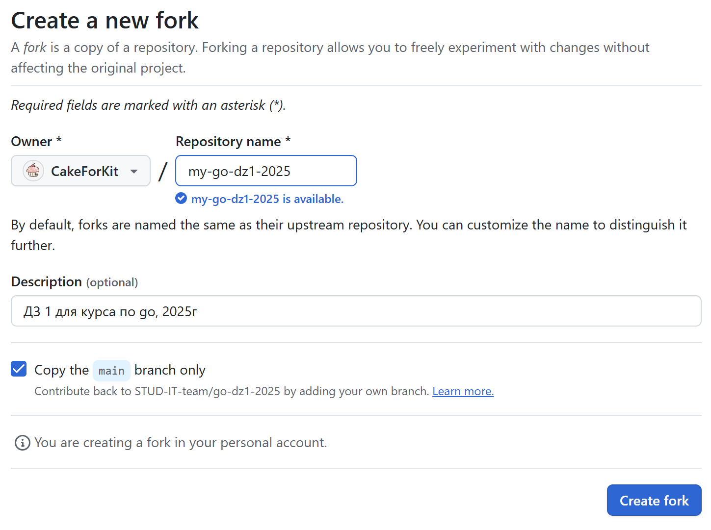
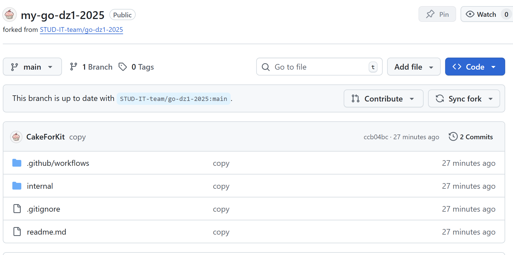
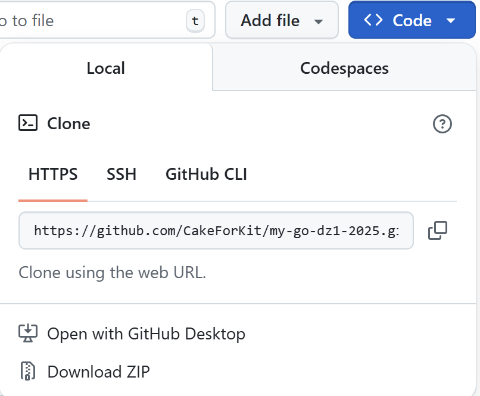
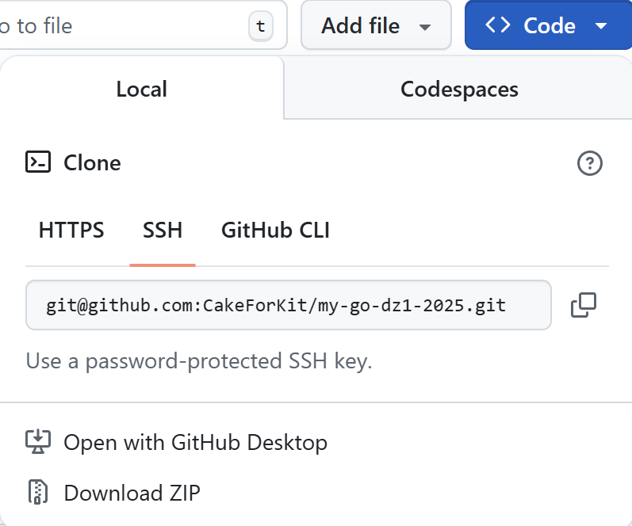
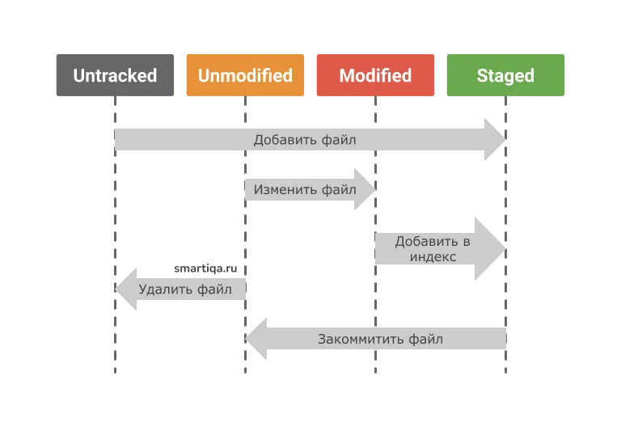
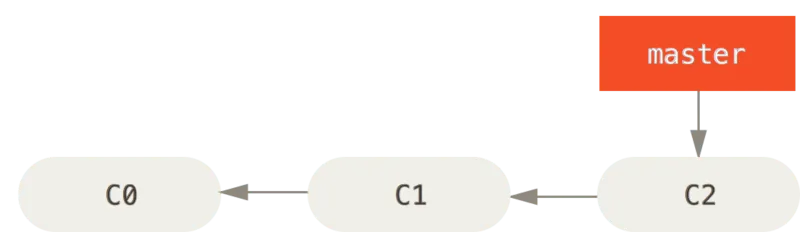

## Fork

Все домашние работы по умолчанию лежат в общем репозитории, поэтому необходимо будет сделать их копии на свои аккаунты, где они и будут выполнятся. Для этого заходим на основную страницу репозитория с домашкой и ищем кнопку Fork:


В поля вводим новое название репозитория, при желании. Далее в конце жмем кнопку “Create fork”.


В результате репозиторий скопировался:


## Получение SSH-ключа

Для подключения к репозиториям необходимо настроить ssh-ключ.

SSH-ключ служит одновременно для идентификации и установления безопасного соединения. Любой SSH-ключ состоит из двух частей - публичной и приватной:

- **Публичный ключ** свободно распространяется и с помощью него шифруются сообщения
- **Приватный ключ** хранится закрыто и с помощью него получатель расшифровывает сообщения

Для работы с GitHub необходимо сгенерировать SSH-ключ и добавить публичную часть в настройки вашего аккаунта. Получить ключ можно с помощью утилиты `ssh-keygen` (входит в состав OpenSSH).

### Генерация SSH-ключа

```bash
ssh-keygen -t rsa -b 4096 -C "your_email@example.com"
```

Разберём параметры:
- `-t` - тип ключа (RSA - надежный алгоритм шифрования)
- `-b` - количество бит (4096 - рекомендуемый размер для большей безопасности)
- `-C` - комментарий к ключу (обычно используется ваш email)

**Важно:** Желательно сохранять ключ по пути `~/.ssh/`, так как это стандартная папка для ключей, и SSH-агент по умолчанию ищет ключи там.

При создании генератор запросит придумать пароль (passphrase) для ключа. Его нужно будет вводить при использовании приватного ключа. Это повышает безопасность, так как защищает ваш ключ в случае получения кем-то доступа к вашему компьютеру.

### Добавление SSH-ключа в GitHub

1. **Скопируйте публичный ключ:**
   ```bash
   cat ~/.ssh/id_rsa.pub
   ```

2. **Добавьте ключ в GitHub:**
   - Перейдите в Settings → SSH and GPG keys
   - Нажмите "New SSH key"
   - Введите название ключа (например, "My Laptop")
   - Вставьте скопированный публичный ключ в поле "Key"
   - Нажмите "Add SSH key"


# Получения токена аутентификации

Токен аутентификации - безопасная замена пароля, которая используется для API gitlab и получения доступа к удаленному репозиторию по https. 

При использовании удаленного репозитория по https, запрашивается не только токен, но также и имя пользователя, хотя имя игнорируется при взаимодействию по токену.
----
Для получения токена переходим в настройки

Пункт токена доступа:
Выбираем кнопку создать новый токен:

Произвольно выбираем название и дата окончания действия токена, главное в доступах ключа выбрать пункт api, затем нажимаем создать токен:

Ключ появится на этой же странице после создания и его лучше сразу сохранить куда-нибудь(желательно в безопасное место), так как на сайте он больше доступен не будет.

С этим токеном можно выполнять любые операции с удаленным репозиторием, каждый раз вводя его вместо пароля(в некоторых средах программирования, например vs code, можно настроить автоматический ввод этого токена при работе с git).

---

## Как получить токен доступа на GitHub
1. Зайдите на GitHub
2. В правом верхнем углу кликните на ваш аватар
3. Выберите **Settings**
4. В левом меню выберите **Developer settings**
5. Затем выберите **Personal access tokens** -> **Fine-grained tokens** -> **Generate new token**
6. Настройте параметры токена
7. Нажмите **Generate token**
8. После создания токен появится на экране **только один раз** и его лучше сразу сохранить куда-нибудь(желательно в безопасное место), так как на сайте он больше доступен не будет.

С этим токеном можно выполнять любые операции с удаленным репозиторием, каждый раз вводя его вместо пароля(в некоторых средах программирования, например vs code, можно настроить автоматический ввод этого токена при работе с git).


# Клонирование

***Для клонирования репозитория потребуется либо токен аутентификации, либо ключ ssh, для получения см. соответствующие пункты гайда.***

Работу с удаленным репозиторием можно вести 2-мя способами:

- Через сайт, вручную изменяя каждый файл.
- Скопировав репозиторий на локальный компьютер и внося изменения в локальную версию, а затем сразу отправлять все изменения за раз на сервер.

Очевидно второй вариант более удобен, поэтому в гите предусмотрена функция клонирования репозитория, то есть получения его локальной копии.

Сделать это можно по https с помощью токена аутентификации и по ssh. При настроенном SSH требуется меньше действий, чем с HTTPS, так как git сам использует необходимые ключи и авторизируется в gitlab.

### HTTPS

Копируем ссылку https ссылку репозитория:


и используем команду git clone :
```bash
git clone https://github.com/username/repository.git
# При запросе логина и пароля:
# Username: ваш_username_на_github
# Password: ваш_токен
```

### SSH

Копируем SSH ссылку репозитория:


И используем команду git clone с этой ссылкой


# Стадии жизни файлов и git add

В локальном репозитории выделяются несколько стадий жизни файла:


- **Неотслеживаемые** - Файлы, которые не относятся к репозиторию, соответсвенно либо не были добавлены, либо были удалены;
- **Индексированные** - В эту стадию помещается либо новые добавленные файлы, либо измененный файл с помощью git add;
- **Немодифицированные** - В этой стадией находится файлы, которые находятся в репозитории(ранее были закоммичены)
- **Модифицированные** - В этой стадии находятся отслеживаемые файлы, которые были изменены, но еще не зафиксированы коммитом.

git add - команда, которая переводит неотслеживаемый или модифицированный файл в индекс, то есть в состояние, из которого после этот будет добавлен в новый коммит

```bash
git add files [--all]
```

Как параметры в git add указываются файлы, которые нужно добавить в индекс или можно подать ключ —all, при котором в индекс добавятся все файлы(плохая практика, так как можно случайно добавить ненужные файлы.)

# Коммиты

Коммит - сохраненное изменение в репозитории. В коммите сохраняется “снимок” нынешнего состояния проекта, а также различные метаданные(время создания, пользователь, родительские коммиты). Благодаря системе коммитов удается прослеживать изменение версий проекта, или откатываться к предыдущим версиям.

При инициализации репозитория создается пустой корневой коммит. Все последующие коммиты создаются от корневого и в них сохраняется нынешнее состояние индексированных файлов. Все коммиты выходят один из другого, образуя цепочку изменений, которую удобно просматривать.

Для создания коммита необходимо добавит изменные или новые файлы в индекс(см. стадии файлов и git add) и использовать команду:

```bash
git commit [-m <text>]
```

-m - необязательный параметр, позволящий прикрепить описание в виде текстового сообщения в консоли(по умолчанию откроется текстовый редактор, в котором нужно будет написать описание).

## Важные команды для работы с коммитами

Историю коммитов можно просматривать с помощью команды:

```bash
git log [-n <number>]
```

В логе также можно найти идентификатор каждого сделанного коммита, который может потребоваться в других командах.

Удалить/отменить коммиты можно 2-мя способами:

```bash
git reset [--hard] <commit-id>
```

Полностью удалит все коммиты до выбранного включительно, при этом если не подан флаг —hard, то оставит изменения выбранного коммита.

```bash
git revert <commit-id>
```

Создает новый коммит, отменяющий изменения внесенные выбранным(правильнее, если выбранный коммиты уже выгружен в удаленный репозиторий, так как это не ломает историю изменений у других разработчиков).


# Выгрузка в удаленный репозиторий

Внесение изменений вносится только в локальный репозиторий, поэтому когда все коммиты сделаны их нужно выгрузить в удаленный репозиторий. Для этого существует команда:

```bash
git push
```

После её выполнения(если используется https, то нужно будет авторизироваться токеном), все коммиты выгрузятся в удаленный репозиторий.

Также в ходе работы git push могут возникнуть конфликты - ситуации, при которых изменения мешают друг другу. В основном это происходит при слиянии ветвей(см. соотв. пункт).


# Ветвление

В git возможно создать несколько параллельных веток проекта из любого коммита. Такие ветки развиваются независимо друг от друга и изменения в файлах одной не меняют другую ветку. Разные ветки также можно сливать в одну, при этом в итоговую ветку попадают все файлы из обоих(если в обоих ветках были одинаковые файлы, но с разным содержанием, то могут возникнуть так называемые конфликты, о них ниже)

По умолчанию в любом проекте git существует главная ветка, которая создаётся при инициализации репозитория. Обычно она называется master или main и, как правило, в ней хранят основную **стабильную** версию проекта, а другие ветви создают для внесения изменений(чтобы после тестирования слить с основной веткой).


## Команды ветвления

С точки зрения реализации ветка - указатель на некоторый коммит, поэтому в примерах так и будем обозначать ветку.

Пусть у нас уже есть некоторый проект с созданными коммитами:


В данном случае master - главная  ветка, указывает на последний коммит в ней.